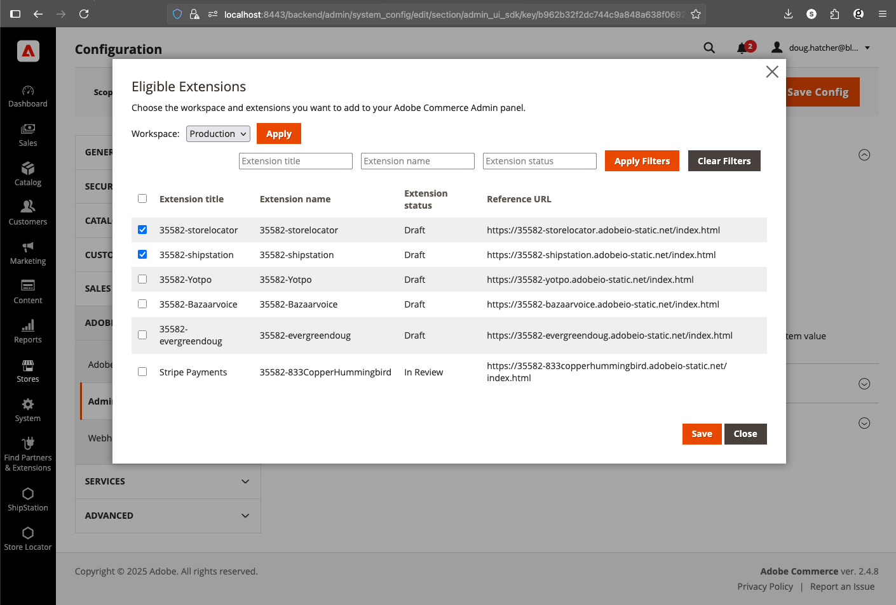
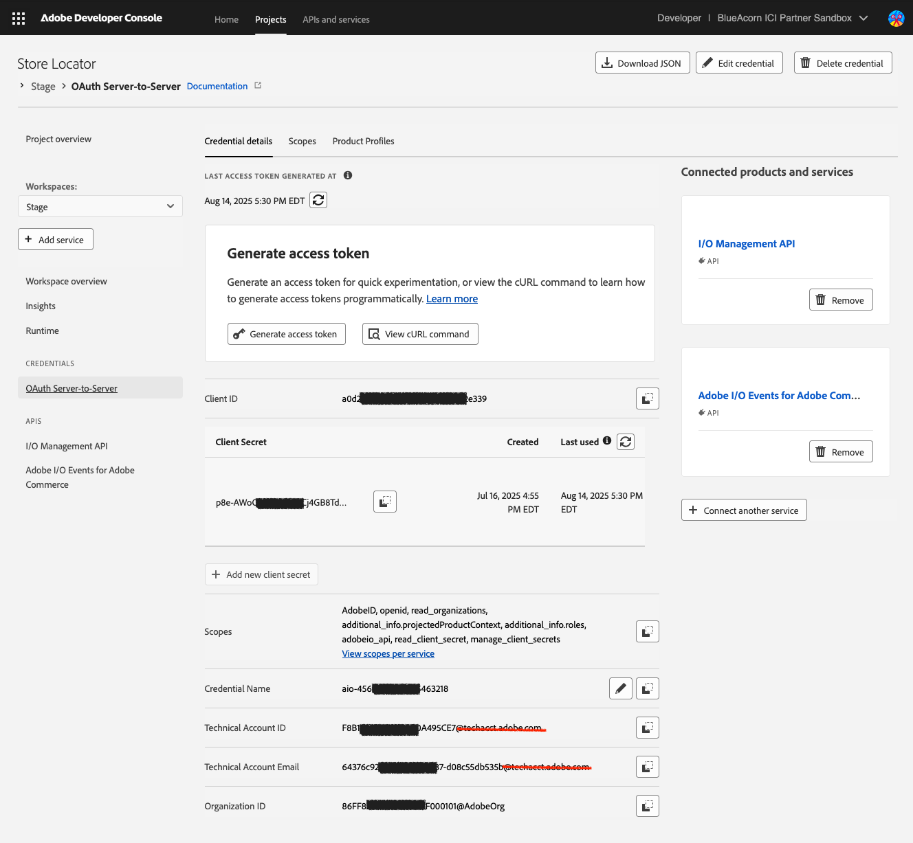

# Automation with Github Actions

This document will talk about how we setup our projects within github to allow for a high degree of automation. It will cover the concepts behind why we do it, and the details required to set this up for yourself.

## Target Audience

Technical contributors working with Adobe Developer App Builder and Adobe Commerce inside of Github

## Github Actions

Github Actions are a great way to automate most anything in a project, and Adobe has provided some actions and tools we can leverage do do various things. This will digest how we use them internally here at Blue Acorn.

### Deployments

We follow Adobe's standard github actions for triggering deployments, which use the official [aio-apps-action](https://github.com/adobe/aio-apps-action) to manage authentication using `oauth server-to-server`. 

## Deployment Flow

Pushing to **main** tiggeres a deployment to the **Stage** App Builder workspace 

Publishing a **release** triggeres a deployment to the **Prod** App Builder workspace

_For some apps, pushing to **main** _also_ triggeres a deployment to a **PaaS** workspace (see [Shipstation](https://github.com/BlueAcornInc/aio-commerce-shipstation/blob/main/.github/workflows/deploy_paas.yml)). This allows us to have a dedicated configuration for our PaaS sandboxes._

For **local development** we suggest each developer create a *workspace* within the app project for their work, for example most of our projects will have workspaces so `doug` and `max` can work withot stepping on each others toes.

## Workspaces and Adobe Commerce 

While commerce admins can support multiple apps, they must all use the same *workspace*. 



It's important to know that all admin apps for ancurrently in August 2025, Adobe Commerce supports Admin apps but it doesn't have app permanance, meaning that it routinely forgets which apps are installed and a developer must configure them when they login to the admin. 

## Setting up Github Actions


Reference action: [Store Locator Deployment Action](https://github.com/BlueAcornInc/aio-commerce-storelocator/blob/main/.github/workflows/deploy_stage.yml)


As you can see, Adobe provides an `aio-apps-action` that can handle authentication:

```yaml
...
      - name: Auth
        uses: adobe/aio-apps-action@3.3.0
        with:
          os: ${{ matrix.os }}
          command: oauth_sts
          CLIENTID: ${{ vars.CLIENTID_STAGE }}
          CLIENTSECRET: ${{ secrets.CLIENTSECRET_STAGE }}
          TECHNICALACCOUNTID: ${{ vars.TECHNICALACCID_STAGE }}
          TECHNICALACCOUNTEMAIL: ${{ vars.TECHNICALACCEMAIL_STAGE }}
          IMSORGID: ${{ vars.IMSORGID_STAGE }}
          SCOPES: ${{ vars.SCOPES_STAGE }}
...
```

These must be fetched, and leverage the Oauth Server-to-Server (oauth-sts) authentication method.



### Note about Deploying API Mesh

API Mesh uses a different deployment mechanism and requires a different auth flow
